# < Barra de Navegacion 🙉>

## Como implemetar la barra de navegacion utilizando el elemento semantico de HTML 5 "nav" con atributos de linea

## uso

1. se crea la estructura del documento HTML.
   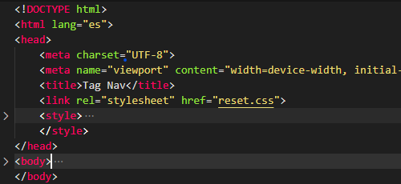.
2. crear el archivo reset.css para formatear los atributos del navegador.
   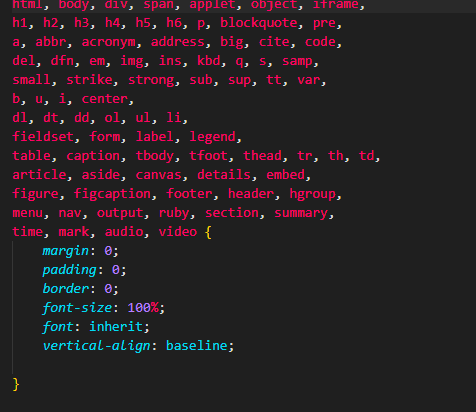.
3. vincular el archivo reset.css al documento html.  
   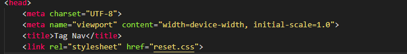.
4. se insertan los tag "nav, ul, li, a" al body del html.
   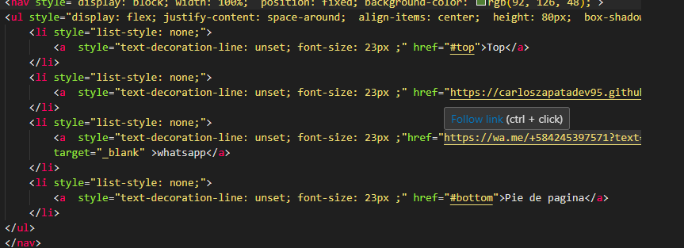. 
5. utilizamos los atributos de linea para dar estilo a cada uno de los elementos.
   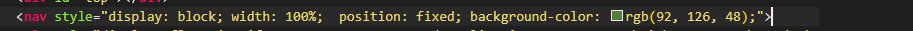,
   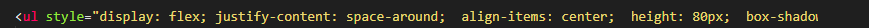,
   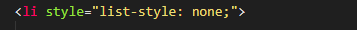,
   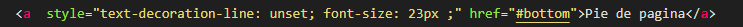.
6. insertamos elementos para crear scroll y hacer pruebas de navegacion desde la barra de navegacion.
   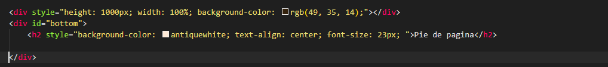.
7. le damos un poco de animacion cambiando el color de los link de atraves de pseudo hover desde el head del documento atraves del tag style.
   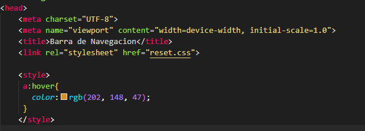.

# y como resultado 
   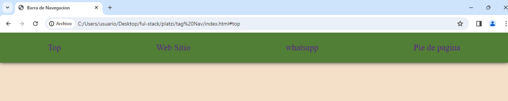.

